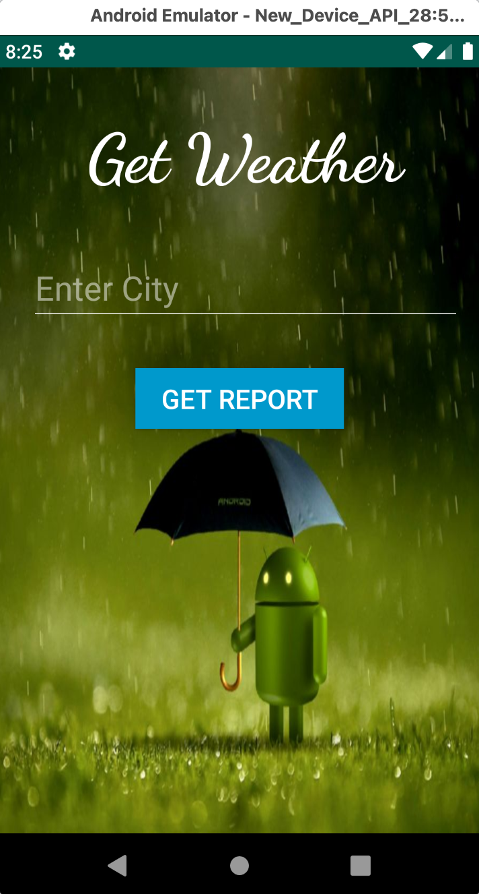
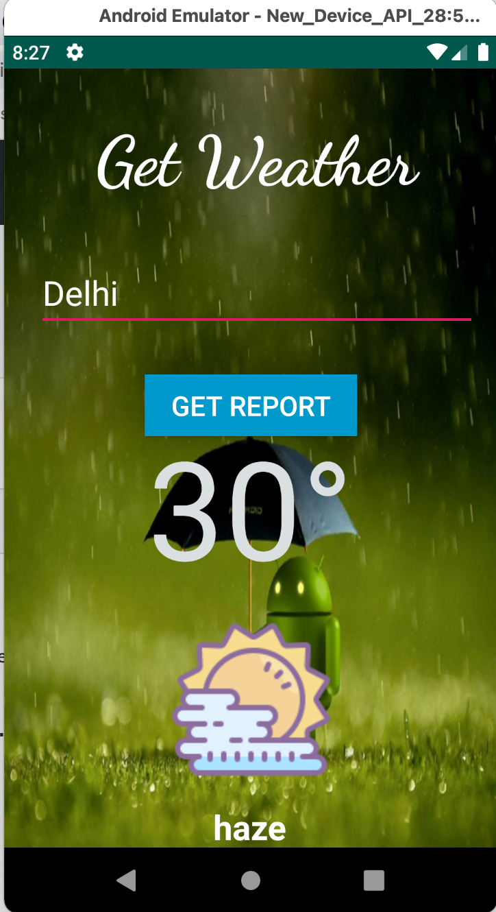
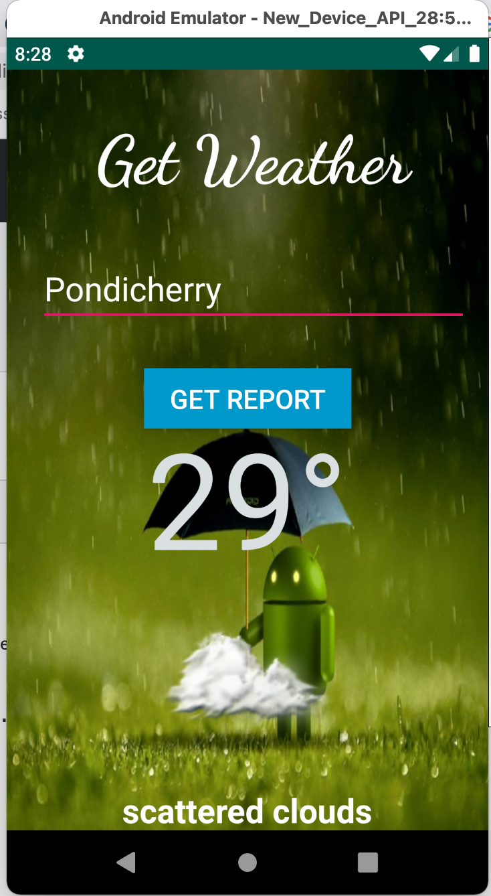

# Weather App

## Overview
This is a simple android app which displays the basic current weather information of any given location.

## How to run 

This weather uses OpenWeatherMap API. Get your API Key from the OpenWeatherMap website (https://openweathermap.org) and enter in the place of “enter your API key here” in MainActivity.java file.

## Weather App Screenshots

<table>
  <tr>
    <td></td>
    <td></td>
  </tr>
<table>

  
  <table>
  <tr>
    <td></td>
  </tr>
<table>
